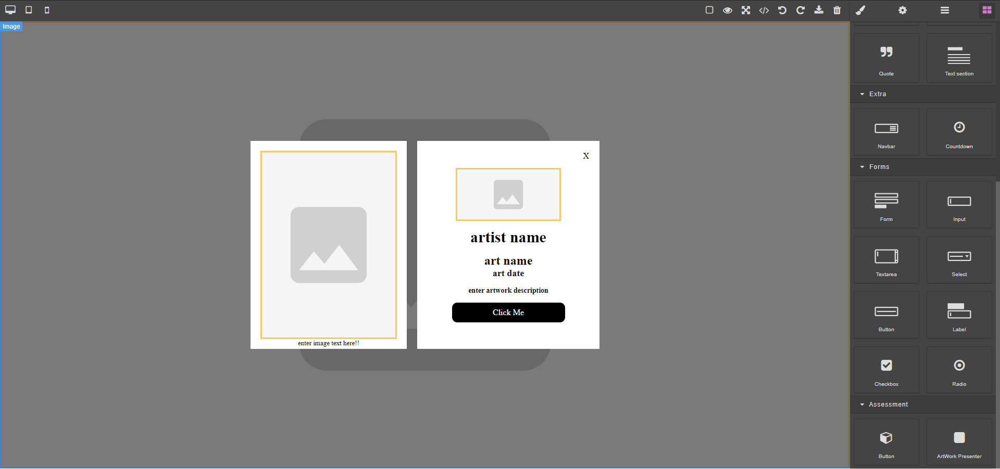
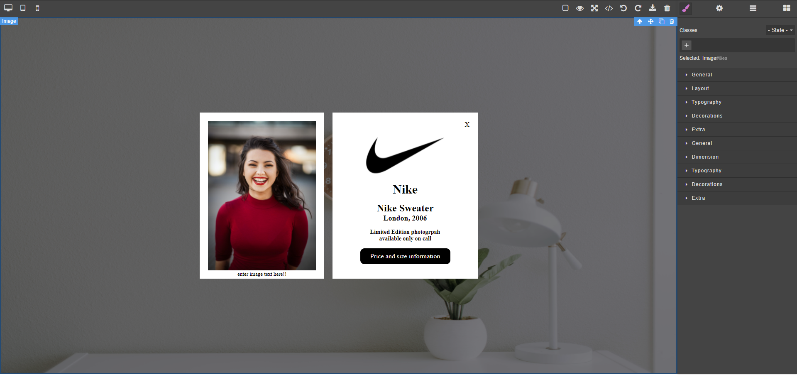

# Emperia GrapesJS Assessment

## Steps followed to complete assessment

1. Bootstrapped create-react-app typescript templated and pushed to github repo
2. Researched on GrapesJS and how to integrate it with ReactJS.
3. Explored GrapesJS and its api for blocks and styling capabilities.
4. Searched community for the confusions faced.
5. Initialized GrapesJS with minimal configurations i.e. **Basic Blocks**
6. Restructured React app for better code management.
7. Added first block to block manager i.e. **Custom Button Component**
8. Implemented skeleton structure for **Artwork Presenter Block**
9. Started writing stylesheet to cater visual looks of **Artwork Presenter Block**
10. Finally tested one last time using the assets given in **/src/assets**

> Disclaimer

- Kept Testing and rechecking on every step with content.
- Kept atomic commits to github so that the code versioning is understandable.

## How to run assessment

1. Clone the repo using https.
2. Run `npm install` to install all the dependencies.
3. Run `npm run start` to execute project in development mode.
4. Navigate to **blocks** section of the GrapesJS toolbar.
5. Scroll down to find the **Assessment section** in blocks.
6. Drag and drop the **Artwork Presenter Block** onto the canvas.
7. Double click the black faded background to upload and select the background image _(from assets if you would like to)_
8. Do the above step both for the **left container image** and the **logo**.
   9 Proceed to fill in the text boxes and rephrase the text to your desire.
9. Your template is now complete.

## Screenshots

- Template Skeleton
  

- Template Filled
  
